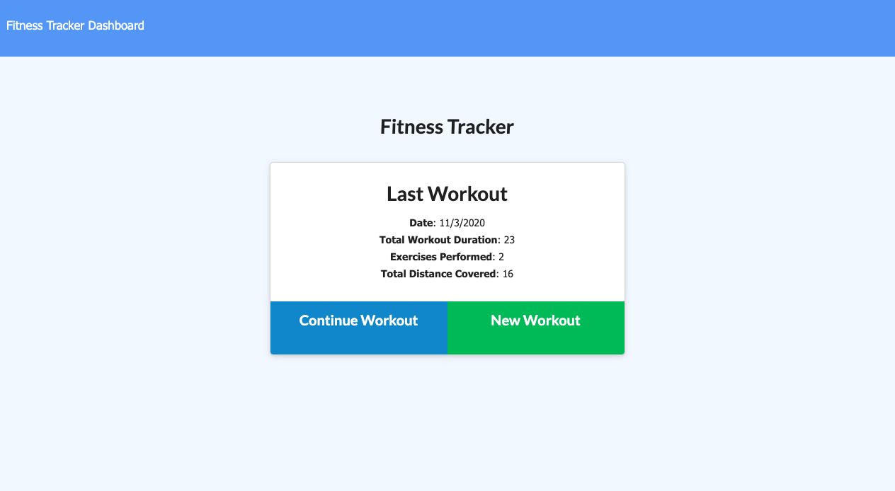
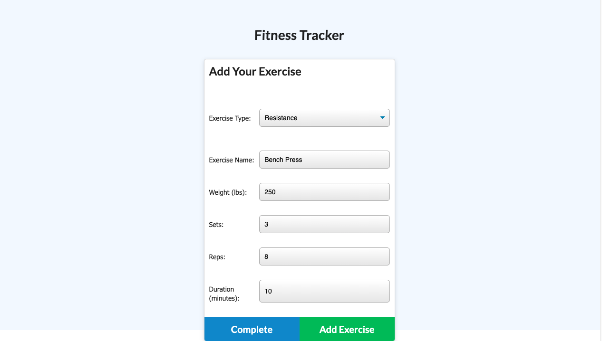
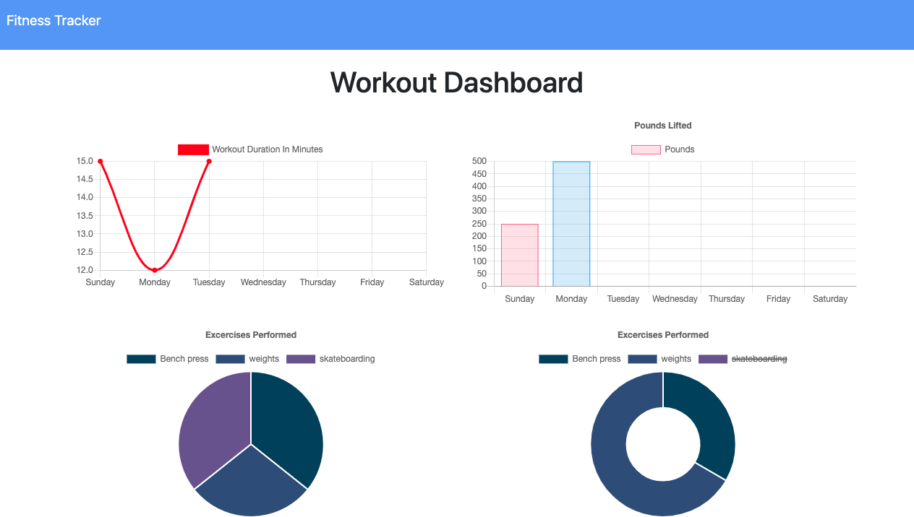

# Workout Tracker

  ## Description:
  As a user, I want to be able to view create and track daily workouts. I want to be able to log multiple exercises in a workout on a given day. I should also be able to track the name, type, weight, sets, reps, and duration of exercise. If the exercise is a cardio exercise, I should be able to track my distance traveled.
  
  
  
 ## Installation:
  No installation required. Application is deployed through Heroku. 
 link to deployed site: https://limitless-woodland-88147.herokuapp.com/
  ## Usage:
  

  ## Contribution
  Andrés Roldán
  ## Test:
  No Tests

  ## Questions
  For more questions about Workout Tracker, please contact me at:
  
  * [Github Profile](http://github.com/dresroldan)
  * dresroldan@gmail.com
      
  